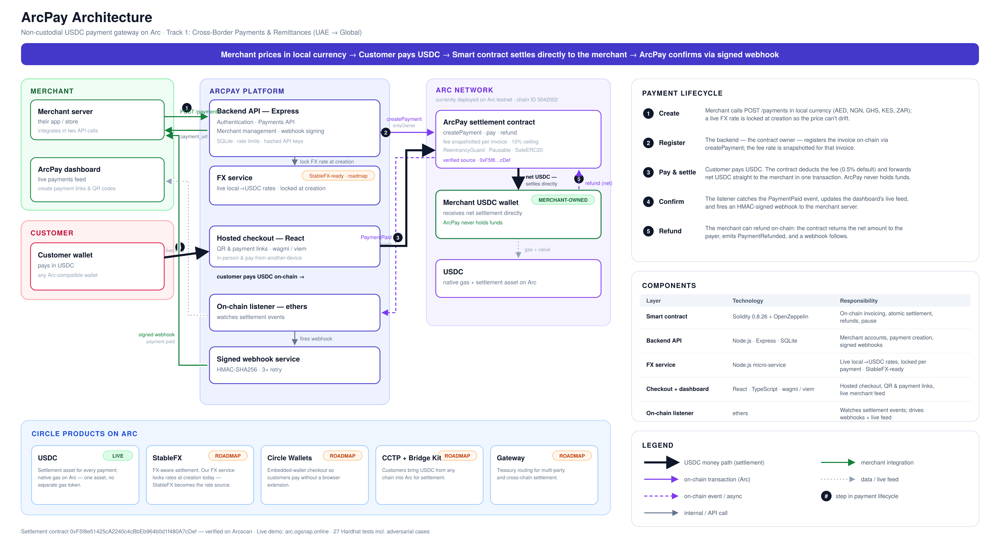

# ArcPay

**USDC payment gateway built natively on Arc.**

Sub-second settlement. Non-custodial. Price in Dirham, Naira, Cedis, Shillings or Rand — settle in stable dollars. Two API calls to integrate.

---

## How it works

```
Merchant creates a payment  →  Customer pays USDC on-chain
         ↓                               ↓
  ArcPay smart contract         Funds land in merchant wallet
  fires a signed webhook              in < 1 second
```

No bank. No FX desk. No middleman holds your money.

---

## Architecture



---

## Quick integration

```js
// 1. Create a payment on your server
const { payment_url } = await fetch('https://arc.ogsnap.online/payments', {
  method: 'POST',
  headers: {
    'Content-Type': 'application/json',
    'X-Api-Key': process.env.ARCPAY_API_KEY,
  },
  body: JSON.stringify({ amount: 45000, currency: 'NGN' }),
}).then(r => r.json());

// 2. Redirect your customer
window.location = payment_url;
```

The customer opens a hosted checkout, connects MetaMask, and pays. You receive a signed webhook when the transaction settles.

---

## Stack

| Layer | Technology |
|---|---|
| Smart contract | Solidity — deployed on Arc testnet |
| Backend API | Node.js / Express / SQLite |
| Frontend | React / TypeScript / Viem / wagmi |
| FX service | Node.js micro-service, live rates every 60 s |
| Infra | PM2 + Nginx, VPS-ready |

---

## Project structure

```
arcpay/
├── contracts/          # ArcPay.sol — atomic on-chain settlement (no escrow)
├── backend/            # REST API (merchants, payments, webhooks)
│   └── src/
│       ├── routes/     # auth · merchants · payments
│       ├── middleware/  # auth guard, rate limiter
│       ├── fx.js        # live FX rates (AED / NGN / GHS / KES / ZAR)
│       ├── listener.js  # on-chain event watcher
│       └── webhook.js   # signed webhook dispatcher
├── frontend/           # React dashboard + hosted checkout
├── footie/             # Reference merchant integration (demo store, priced in AED)
├── ngn/                # FX micro-service (separate process)
├── nginx/              # Nginx site config
├── scripts/            # deploy, setup, e2e
└── test/               # Hardhat contract tests (27 passing)
```

---

## Run locally

**Prerequisites:** Node.js 18+, MetaMask, Arc testnet USDC

```bash
# 1. Install root deps (Hardhat)
npm install

# 2. Run contract tests
npx hardhat test

# 3. Start the backend
cd backend && npm install
cp .env.example .env   # fill in your values
node index.js          # → http://localhost:3001

# 4. Start the FX service (separate terminal)
cd ngn && npm install
node server.js         # → http://localhost:3002

# 5. Start the frontend
cd frontend && npm install
cp .env.production.example .env.local
npm run dev            # → http://localhost:3000
```

---

## Environment variables

**`backend/.env`**

| Variable | Description |
|---|---|
| `PORT` | API port (default `3001`) |
| `APP_URL` | Base URL used in checkout links |
| `JWT_SECRET` | Long random string — `openssl rand -hex 48` |
| `ARCPAY_ADDRESS` | Deployed contract address |
| `ARC_TESTNET_RPC` | Arc testnet RPC URL |

**`frontend/.env.local`**

| Variable | Description |
|---|---|
| `VITE_API_URL` | Backend base URL |
| `VITE_ARCPAY_ADDRESS` | Same contract address as backend |
| `VITE_WALLETCONNECT_PROJECT_ID` | From cloud.walletconnect.com |

---

## API reference

Auth: `X-Api-Key: <key>` on all merchant endpoints.

| Method | Path | Description |
|---|---|---|
| `POST` | `/merchants` | Register — returns API key + webhook secret |
| `POST` | `/payments` | Create payment, get `payment_url` |
| `GET` | `/payments` | List payments (filterable, paginated) |
| `GET` | `/payments/:id` | Single payment status |
| `GET` | `/merchants/me` | Profile + live USDC balance |
| `PUT` | `/merchants/me` | Update wallet, webhook URL, markup |
| `GET` | `/api/rates` | Live FX rates (public) |

---

## Webhooks

ArcPay POSTs to your `webhook_url` after every on-chain event. Retried 3× on failure.

```json
{
  "event":        "payment.paid",
  "payment_id":   "0x…",
  "order_id":     "your-order-id",
  "amount_usdc":  1497678,
  "amount_local": 55,
  "rate":         3.67,
  "currency":     "AED",
  "status":       "paid",
  "payer":        "0x…",
  "tx_hash":      "0x…",
  "timestamp":    "2026-06-04T14:00:00.000Z"
}
```

`amount_usdc` is in USDC micro-units (6 decimals). `amount_local` is whole units
of the priced currency (`amount_ngn` is still sent as a deprecated alias). For a
USDC-priced payment, `amount_local`/`rate` are `null`.

**Verify the signature (Node.js):**

```js
const crypto = require('crypto');

app.post('/webhook', express.raw({ type: 'application/json' }), (req, res) => {
  const sig      = req.headers['x-arcpay-signature'];
  const expected = 'sha256=' +
    crypto.createHmac('sha256', process.env.ARCPAY_WEBHOOK_SECRET)
          .update(req.body).digest('hex');

  if (!crypto.timingSafeEqual(Buffer.from(sig), Buffer.from(expected)))
    return res.sendStatus(401);

  const { event, order_id } = JSON.parse(req.body);
  if (event === 'payment.paid') {
    // fulfil the order
  }
  res.sendStatus(200);
});
```

---

## Smart contract

`contracts/ArcPay.sol`

| Function | Caller | Description |
|---|---|---|
| `createPayment(id, merchant, amount, deadline)` | owner (backend) | Registers an invoice on-chain; snapshots the fee for this payment |
| `pay(id)` | customer | **Atomic settle** — deducts the fee and forwards the net USDC straight to the merchant in one transaction. No escrow, no separate release step. |
| `refund(id)` | merchant | Returns the **net** amount (what the merchant received) to the payer — the protocol fee is not refunded |
| `setFeeBps(bps)` / `setFeeRecipient(addr)` | owner | Adjust protocol fee / fee wallet |
| `pause()` / `unpause()` | owner | Circuit breaker |

**Fee:** default **0.5%** (50 bps), owner-adjustable up to a hard-coded **10% ceiling** (`MAX_FEE_BPS`). Each payment **snapshots its fee at creation** (`feeBpsSnapshot`), so a later fee change never reprices in-flight invoices. Built with OpenZeppelin `Ownable`, `ReentrancyGuard`, `Pausable`, and `SafeERC20`.

---

## Supported markets

| Country | Currency | Symbol |
|---|---|---|
| UAE | AED | AED |
| Nigeria | NGN | ₦ |
| Ghana | GHS | ₵ |
| Kenya | KES | KSh |
| South Africa | ZAR | R |

Rates are fetched live every 60 seconds and locked at payment-creation time.

---

## Built on Arc + Circle

ArcPay settles every payment in **USDC on Arc**. On Arc, USDC is also the native
gas token, so neither the merchant nor the customer needs a separate gas asset,
which is the key to onboarding non-crypto users in emerging markets. Arc's
deterministic, sub-second finality lets the checkout confirm a payment almost
immediately.

**Arc testnet parameters**

| Item | Value |
|---|---|
| Chain ID | `5042002` |
| USDC (native gas + settlement) | `0x3600000000000000000000000000000000000000` (6 decimals) |
| ArcPay settlement contract | `0xF5f8e51425cA2240c4cBbEb964b0d1f480A7cDef` |
| Explorer (verified source) | [Arcscan](https://testnet.arcscan.app/address/0xF5f8e51425cA2240c4cBbEb964b0d1f480A7cDef#code) |
| Testnet USDC faucet | https://faucet.circle.com |

> Note: when adding Arc to MetaMask via `wallet_addEthereumChain`, set
> `nativeCurrency.decimals` to `18` (MetaMask rejects other values), even though
> USDC itself uses 6 decimals for all amounts.

**Circle products used:** USDC (settlement rail + native gas).

**FX layer:** ArcPay's FX micro-service locks a mid-market rate at payment
creation so a local-currency price (e.g. AED) can't drift before the customer
pays — the same multi-currency, FX-aware settlement problem Circle's **StableFX**
is built to solve. It's a natural next integration to replace our own rate source.

**Roadmap:** CCTP + Bridge Kit (cross-chain USDC pay-in), Circle Wallets
(embedded-wallet checkout for non-crypto users), Gateway (treasury routing),
StableFX (FX-aware settlement).

Verifying the contract on Arcscan (Blockscout) uses `hardhat-verify` with the
`customChains` block in [`hardhat.config.js`](hardhat.config.js):

```bash
npx hardhat verify --network arcTestnet <address> <usdc> <feeRecipient> <feeBps>
```

---

## Deploy to VPS

See [`DEPLOY.md`](DEPLOY.md) for the full step-by-step guide covering Nginx, PM2, and HTTPS.
